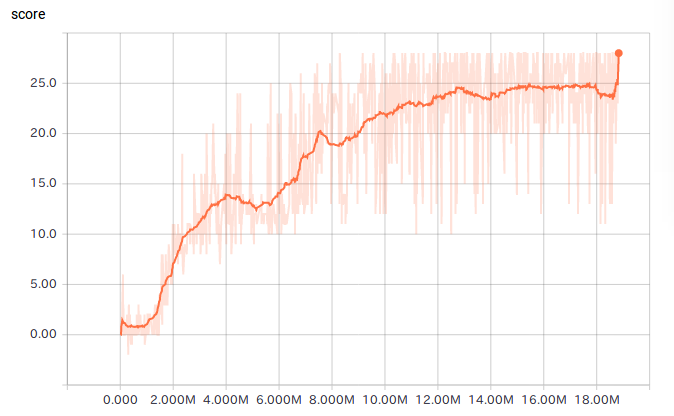

# UNREAL

## About

An attempt to repdroduce UNREAL algorithm described in Google Deep Mind's paper "Reinforcement learning with unsupervised auxiliary tasks."

https://arxiv.org/pdf/1611.05397.pdf

## Preview
[](https://youtu.be/k0KpBP5rs5I)

## Network


All weights of convolution layers and LSTM layer are shared.

## Requirements

- TensorFlow (Tested with r0.12)
- DeepMind Lab
- numpy
- cv2
- pygame
- matplotlib

## Result
Score plot of DeepMind Lab "seekavoid_arena_01" environment.



## How to run
First, dowload and install DeepMind Lab
```
$ git clone https://github.com/deepmind/lab.git
```
Then build it following the build instruction. 
https://github.com/deepmind/lab/blob/master/docs/build.md

Clone this repo in lab directory.
```
$ cd lab
$ git clone https://github.com/miyosuda/unreal.git
```
Add bazel instrution for unreal at the end of `lab/BUILD` file

```
# Setting for unreal
py_binary(
    name = "unreal_train",
    srcs = ["unreal/main.py"],
    data = [":deepmind_lab.so"],
    main = "unreal/main.py"
)

py_binary(
    name = "unreal_display",
    srcs = ["unreal/display.py"],
    data = [":deepmind_lab.so"],
    main = "unreal/display.py"
)

py_test(
    name = "unreal_test",
    srcs = ["unreal/test.py"],
    main = "unreal/test.py",
    deps = [":unreal_train"],
)
```

Then run bazel command to run training.
```
bazel run :unreal_train --define headless=osmesa
```

To show result after training,
```
bazel run :unreal_display --define headless=osmesa
```
